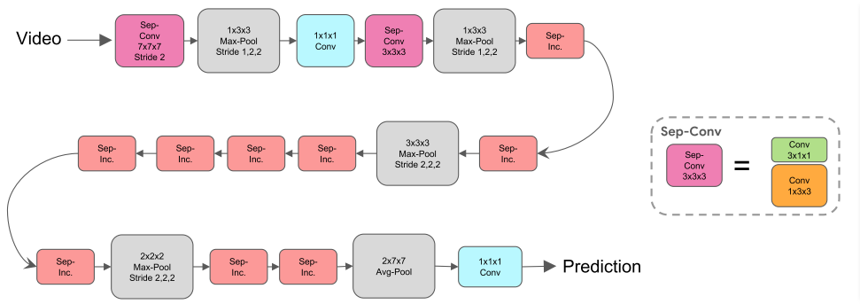
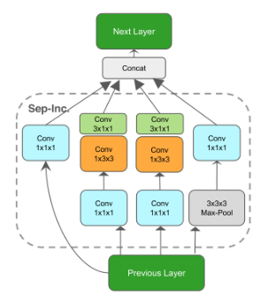

# s3d_g_pytorch
Separable 3D CNN with a spatio-temporal gating mechanism(S3D_G), proposaled in [Rethinking Spatiotemporal Feature Learning: Speed-Accuracy Trade-offs in Video Classification][s3d_g](*ECCV2018*).    
(**Just finishing S3D part, updatting!!!**) 

## About the repo
This repo is to reimplement **S3D_G**, a powerful neural network for extracting **spatial-temporal features** from video/continuous frames. It produces very competitive result on several action classification benchmarks. For more detail, please access the link above.    

 

[s3d_g]: https://arxiv.org/abs/1712.04851