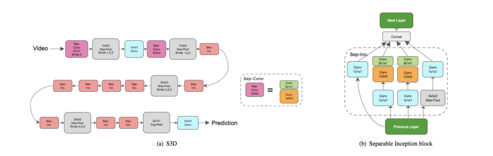

# s3d_g_pytorch
Separable 3D CNN with a spatio-temporal gating mechanism(S3D_G), proposaled in [Rethinking Spatiotemporal Feature Learning: Speed-Accuracy Trade-offs in Video Classification][s3d_g](*ECCV2018*).    
(**Finish completely!!!**) 

## About the repo
This repo is to reimplement **S3D_G**, a powerful neural network for extracting **spatial-temporal features** from video/continuous frames. It produces very competitive result on several action classification benchmarks. For more detail, please access the link above.    



## Prerequisite
- python3
- Pytorch1.0

## Quickly Start
### Clone this repo

```
$ git clone https://github.com/BIGJUN777/s3d_g_pytorch.git   
```

### Install dependencies using pip
```
$ pip install -r requirements.txt
```


### Prepare dataset
1. Download database: [UCF101](UCF101) or HMDB51.(**Now just ucf101 supported!**)
2. Create the folder and put the database into by making symlinks(or you can put databases into directly)
	```
	$ mkdir dataset     		
	$ ln -s .../UCF101/UCF-101 dataset/UCF-101
	``` 
3. Train the model. It will take some time to process the data in the first time running. Pay attention pls. Add `-h` to see more optional arguments.
	```
	$ python train.py
	```
4. Visualization: 
	```
	$ tensorboard --logdir=log
	```
### Inference/Demo
```
$ python inference.py --video path/to/a/video
```

## Reference
- [jfzhang95/pytorch-video-recognition](https://github.com/jfzhang95/pytorch-video-recognition)
- [rimchang/kinetics-i3d-Pytorch](https://github.com/rimchang/kinetics-i3d-Pytorch)
- [hassony2/kinetics_i3d_pytorch](https://github.com/hassony2/kinetics_i3d_pytorch)
- [qijiezhao/s3d.pytorch](https://github.com/qijiezhao/s3d.pytorch)

[s3d_g]: https://arxiv.org/abs/1712.04851
[UCF101]: https://www.crcv.ucf.edu/data/UCF101.php